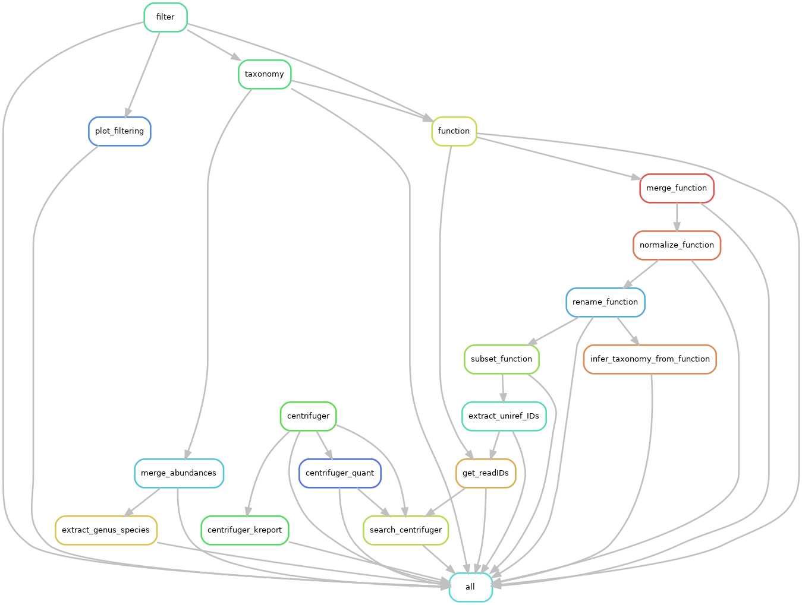

# GDSC-MGX-Pipieline
Snakemake pipeline for preprocessing of metagenomics using Biobakery tools

## Introduction 
The pipeline is designed to provide efficient pre-processing of metagenomics samples (MGX) data on high performance computing clusters (HPCs) using the Torque/PBS scheduler or using a single high CPU, high RAM machine, for the *Genomic Data Science Core (GDSC)* of the *Center for Quantitative Biology (CQB)*, located at Dartmouth College. Both single- and paired-end datasets are supported. The pipeline has been built and tested using human data sets. Required software can be installed using Conda with the enrionment file (environment.yml), or specified as paths in the config.yaml file.


## Pipeline summary:
This pipeline makes use of [The Biobakery](https://github.com/biobakery) The major steps implmented in the pipeline include: 

- FASTQ quality control assesment using [*FASTQC*](https://www.bioinformatics.babraham.ac.uk/projects/fastqc/)
- Host read filtering using [*kneaddata*](https://huttenhower.sph.harvard.edu/kneaddata/)
- Taxonomic classification using [*metaphlan*](https://huttenhower.sph.harvard.edu/metaphlan/) and [*centrifuger*](https://github.com/mourisl/centrifuger)
- Function classification using [*humann*](https://huttenhower.sph.harvard.edu/humann/) 
- Alpha diversity calculation
- *Optional* Linking taxanomy and function

## Implementation

This pipeline uses Snakemake to submit jobs to the scheduler, or spawn processes on a single machine, and requires serveral variables to be configured by the user when running the pipeline:
All these settings can be modified under the *General settings* tab within `config.yaml`

- **sample_csv:** A CSV file containing sample names and paths to fastq files. See example in this repository for formatting.

- **layout:** One of "single" or "paired"

- **proj_dir:** A path to the working directory

- **tmp_dir:** A path to a temporary directory 

- **run_tax2Func:** Boolean, one of "True" or "False" of whether to not to run the additional Snakemake module `workflows/function_to_taxonomy.smk` as part of the main workflow. *Note, this module can be ran as a standalone pipeline as well following the main pipeline*

- **function_term:** Optional. A functional term of which to link taxonomy. This must be formatted identically to the Humann3 output, OR a list of terms formatted as such ["termA", "termB", "termC"]

- **metaphlan_analysis_type:** One of "rel_ab_w_read_stats" for estimated counts as well as relative abundance, or "rel_ab" for just relative abundances. See `metaphlan -h` for a list of additional possible arguments.

- **Humann3 variables:** "mode" refers to whether to use uniref90 or uniref50. "normMethod" refers to how counts should be normalized. Default is counts-per-million (CPM.)

## Running the pipeline

To run the main pipeline, simply run the `job.script.sh` using SLURM

```shell
sbatch job.script.sh
```

To run the function to taxonomy module as a stand-alone pipeline instead as part of the main pipeline, set `run_tax2Func: False` in `config.yaml`.



